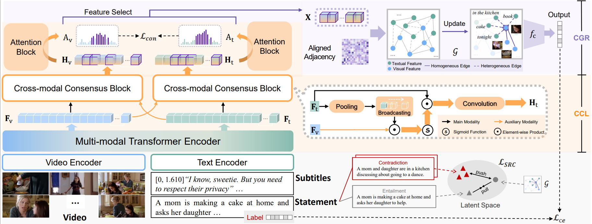

# MM2023 - SAMCN
## Introduction



### Video Entailment via Reaching a Structure-Aware Cross-modal Consensus

Xuan Yao, Junyu Gao, Mengyuan Chen, **Changsheng Xu***

*Correspondece should be addressed to C.X.

State Key Laboratory of Multimodal Artificial Intelligence Systems, Institute of Automation, Chinese Academy of Sciences.

[Paper Link on ACM MM 2023](https://dl.acm.org/doi/10.1145/3581783.3612345) 


## Prerequisites
### 1 Environment

```
conda create -n samcn python=3.9
pip install -r requirements.txt
```
* `requirements.txt` contains the core requirements for running the code in the `SAMCN` packages.
NOTE: pytorch > = 1.2

### 2 Data Preparation
#### a) VIOLIN dataset:

1. We use the visual features, statements and subtitles provided by CVPR 2020 paper: [VIOLIN: A Large-Scale Dataset for Video-and-Language Inference](https://arxiv.org/pdf/2003.11618.pdf). Please download the visual features([C3D features](https://drive.google.com/file/d/10MQ_ceFdhtJYP3CYmm1JoBAQSmnvzv-w/view?pli=1)), [statements and subtitles](https://drive.google.com/file/d/15XS7F_En90CHnSLrRmQ0M1bqEObuqt1-/view) and unzip it under the `./dataset/violin` folder.


2. We represent the statement and subtitles using the pretrained RoBERTa encoder provided by arXiv 2019 paper: [Roberta: A robustly optimized bert pretraining approach](https://arxiv.org/pdf/1907.11692.pdf). Please download the [pre-trained Roberta model]( https://huggingface.co/roberta-base/tree/main) and put it into the `./roberta.base` folder.`
  

#### b) VLEP dataset (TODO)


## Train & Test

#### a) VIOLIN dataset:
```
python violin_main.py --results_dir_base 'YOUR OUTPUT PATH' \
                      --feat_dir ./dataset/violin \
                      --bert_dir ./roberta.base \
                      --model VlepModel \
                      --data ViolinDataset \
                      --lr1 5e-6 \
                      --beta1 0.9 \
                      --first_n_epoch 60 \
                      --batch_size 8 \
                      --test_batch_size 8 \
                      --feat c3d \
                      --input_streams vid sub \
                      --dropout 0.3 \
                      --cmcm \
                      --cmcm_loss \
```

#### b) VLEP dataset (TODO)


## Acknowledgements
We acknowledge that the part of the video entailment code for violin dataset is adapted from [violin](https://github.com/jimmy646/violin). Thanks to the authors for sharing their code.


## Related Work

* [VIOLIN: A Large-Scale Dataset for Video-and-Language Inference](https://arxiv.org/pdf/2003.11618.pdf)
* [What is More Likely to Happen Next?Video-and-Language Future Event Prediction](https://arxiv.org/pdf/2010.07999.pdf)

## Citation

Feel free to cite this work if you find it useful to you!
```
@inproceedings{Yao2023VideoEV,
  title={Video Entailment via Reaching a Structure-Aware Cross-modal Consensus},
  author={Xuan Yao and Junyu Gao and Mengyuan Chen and Changsheng Xu},
  journal={Proceedings of the 31st ACM International Conference on Multimedia},
  year={2023},
  url={https://api.semanticscholar.org/CorpusID:264492780}
}
```


